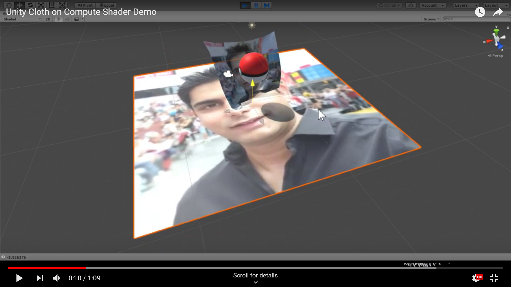

# Fusion
Unity Physics on GPU

## Week 1 - 11/19/2018
Jie - Compute Shader Pipeline Setup and test

## Week 2 - 11/28/2018 (Wednesday)
Jie - Port MileStone1 CPU PBD cloth into Unity Compute Shader 

------------------------------

--------------------------------

#### Interactive Video

