# Fusion - Unity Physics on GPU

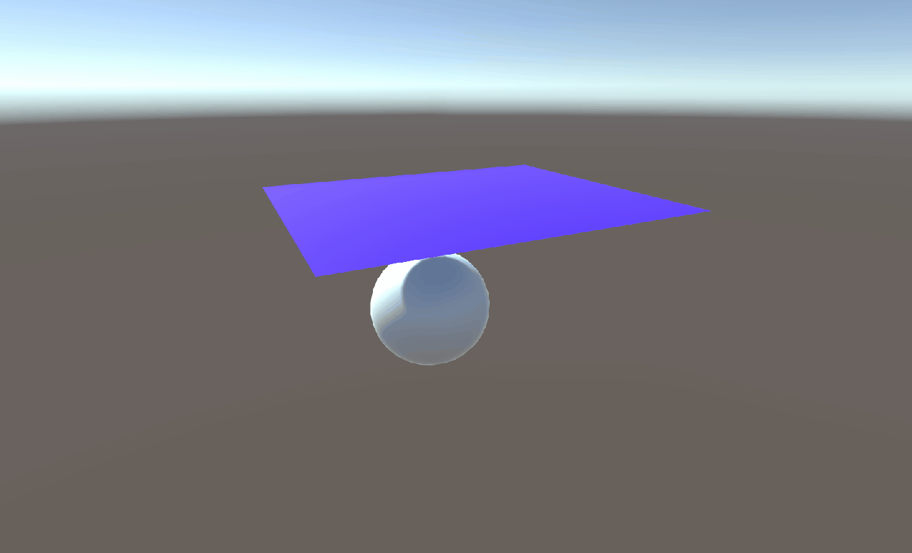
---------------------------------
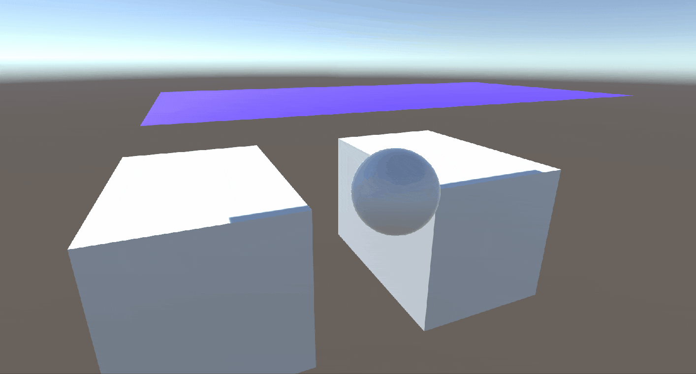
-----------------------------------

---------------------------------------

---------------------------------

## Authors
* Jie Meng
  * [GitHub](https://github.com/Ninjajie), [personal website](https://jie-m.com), [LinkedIn](https://www.linkedin.com/in/jie-meng)

* Yichen Shou
  * [LinkedIn](https://www.linkedin.com/in/yichen-shou-68023455/), [personal website](https://www.yichenshou.com/), [Github](https://github.com/asacoolguy)

FYI, we are team Jethan(J Ethan)

## To Use

**To use Fusion Plugin, simply download or clone, and open the project in Unity. Follow the User guide in [Cloth Plugin](https://github.com/Ninjajie/Fusion#cloth-plugin-user-guide) and [Fluid Plugin](https://github.com/Ninjajie/Fusion#fluid-plugin-user-guide) to generate your physical cloth or fluid**

## Introduction

Fusion is built in the spirit of enabling developers to have "physics" in their game without sacrificing performance, or at least, not too much performance. We choose to base our simulation on **Position-Based-Dynamics**, which already gives good performances when running on CPU and pretty easy to parallelize.

PBD could support many types of physical objects, we choose to implement **Cloth** and **Fluid** since they are hard to achieve without actual physics simulation, and they give vivid results when finished.

We aimed at making a usable **Unity plugin** so that the users could easily add physics-conformed cloth and fluid in their game environment or make a game fully focused on interaction with fluid or cloth.

## Table of Contents
 - [Authors](https://github.com/Ninjajie/Fusion#authors)
 - [Introduction](https://github.com/Ninjajie/Fusion#introduction)
 - [1. PBD](https://github.com/Ninjajie/Fusion#1-the-position-based-dynamics-method)
 - [2. GPU computing in Unity](https://github.com/Ninjajie/Fusion#2-gpu-computing-in-unity)
 - [3. Cloth Simulation](https://github.com/Ninjajie/Fusion#3-cloth)
   - [Cloth Plugin](https://github.com/Ninjajie/Fusion#cloth-plugin-user-guide)
   - [Interactivity](https://github.com/Ninjajie/Fusion#interactivity)
 - [4.Fluids Simulation](https://github.com/Ninjajie/Fusion#4-fluid)
   - [PBF](https://github.com/Ninjajie/Fusion#the-position-based-fluid)
   - [Fluid Plugin](https://github.com/Ninjajie/Fusion#fluid-plugin-user-guide)
   - [Interactivity](https://github.com/Ninjajie/Fusion#interactivity-1)
 - [5. More Object Types](https://github.com/Ninjajie/Fusion#5-more-possible-physical-object-types)
 - [6. Performance Analysis](https://github.com/Ninjajie/Fusion#6-performance---the-power-of-gpu)
   - [Cloth Performance](https://github.com/Ninjajie/Fusion#6-performance---the-power-of-gpu)
   - [Fluid Performance](https://github.com/Ninjajie/Fusion#performance-on-fluid-the-gpu-power-benchmark)
 - [7. References](https://github.com/Ninjajie/Fusion#7-references)
 - [8. Easter Eggs](https://github.com/Ninjajie/Fusion#8-easter-eggs)

## 1. The Position Based Dynamics method
PBD is basically a method to do physics simulation. Comparing to other traditional methods like mass-spring system, FEM, SPH and FLIP, PBD is not physically accurate because no inner force of the system is calculated from physical laws. But a huge advantage of PBD is that it's very fast, and produces visually-plausible simulation results, which makes PBD perfect solution for simulation in games. 

In PBD, physics is simulated by inter-particle "constraints", this feature makes PBD quite flexible since we can just keep adding new types of constraints to the system to simulate the physical properties we want.

PBD is originally designed for cloth simulation, but newer PBD methods could supports new types of objects like rigid body and fluid.

Another reason we choose PBD is because it's easy to parallelize so that we could run it on the GPU to accelerate the simulations. As the [Paper]() mentioned, the Jacobi solver is very suitable for Massively parallel plantform like modern GPUs.

## 2. GPU computing in Unity
Unity now supports GPU computing feature by adapting Microsoft's DirectCompute technique into unity. The compute shaders are written in HLSL and can utilize GPU computing in a similar fashion as CUDA: the kernels are defined in compute shaders, you pack and pass data from CPU side through compute buffers, then after compute you read data from CPU side and use it in whatever way you want.

To start with unity's compute shaders, I found these tutorials and examples quite helpful. Starting with a simple particle system example should provide enough knowledge to begin with.

## 3. Cloth
The way position based dynamics handles cloth simulation is quite simple: each vertex in the cloth is treated as a particle with various inter-particle "constraints", and the algorithm simply needs to make sure none of the constraints are violated at every frame. 

An important thing to note is that none of these constraints are physics based; they are simply introduced to make sure the particles behave a certain way that looks correct. The distance constraint, for example, simply makes sure two connected vertices don't stretch too much beyond their starting distance. The bending constraint makes sure two connected triangles don't bend too much beyond or below a certain starting angle.

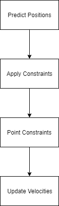

Many expressive constraints are invented every year since the algorithm was first described in 2008, and the ability to add any constraint to the simulation to achieve a desired effect is one of the advantages of this algorithm.

#### Cloth Plugin User Guide
The UI following the cloth script:

Inside UI you can directly change almost all controllable variables, including:
 - Time step
 - Iteration number
 - Constraint weights and vertices' mass

and so on.

#### Interactivity

You can set your own point constraints on the cloth in the inspector or by dragging your mouse.

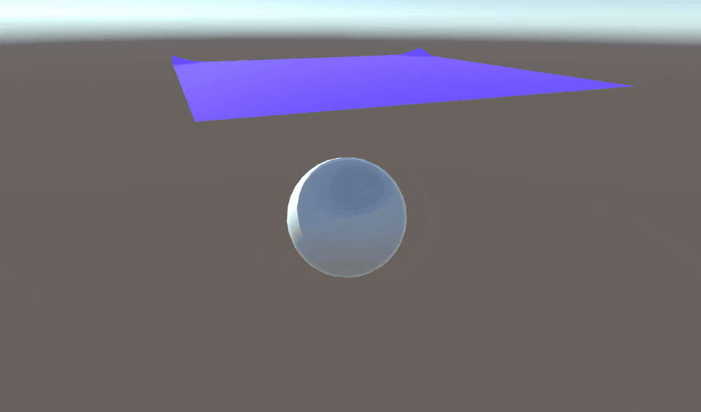

The cloth is completely integrated into Unity, so feel free to move/rotate it just like any other gameobject.

The plugin (incompletely) supports importing meshes as clothes, but duplicate vertices coming from UVs will make the cloth model into two-pieces, the inner surface and the outer surface. As you can see from the following gif, the simulation runs correctly on both pieces.

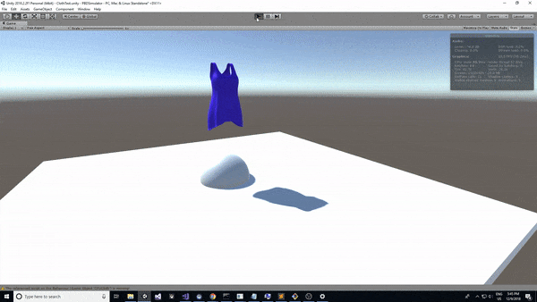

## 4. Fluid

#### The position based fluid

Comparing to Cloth simulation, PBD fluid, or shortly, PBF, requires not only new types of constraints, but also extra stages in the computation pipeline. As the following flow chart suggests:

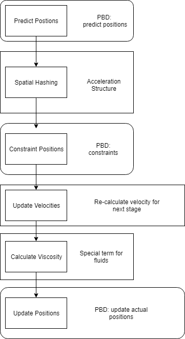

Fluid simulation requires searching for neighboring particles, so we construct and maintain a hash grid structure for the solver, from which you can easily get the particle IDs inside any Cell or grid simply by providing the cell ID the current particle lies in.

In completing the hash grid structure, a sorting algorithm is required to perform efficient sorting on <key,value> pairs. Here parallel Bitonic sorting is adapted from Microsoft's example code of DirectX SDK. 

#### Fluid Plugin User Guide
To create a fluid simulation scene, first of all you need to create a gameobject and attach the `PBFluidScript.cs` to it as a component. In the UI element following the script:

Inside the UI, you can directly change:
 - The time step 
 - The amount of particles you want to have in the simulation
 - The initial velocity of the fluid chuck
 - The number of iterations the solver runs
 - The thickness of Boundary

Besides, to actually view the particles, you need 
 - A material for the particles, using the `Particle` shader to enable GPU instancing
 - A mesh for the individual particles

In order to make the fluid simulation interactive, the plugin enables:
 - create a cube of any size, and assign its transformation to the script's _ContainerTransform_, so that the fluid is within the container
 - create a cube defining the volume of the fluid body, the fluid particles will start moving from the position that this cube defines, assign its transformation to the _FluidChunkTransform_
 - To ignore the cube above in rendering, assign its mesh renderer to the _FluidChuckRenderer_

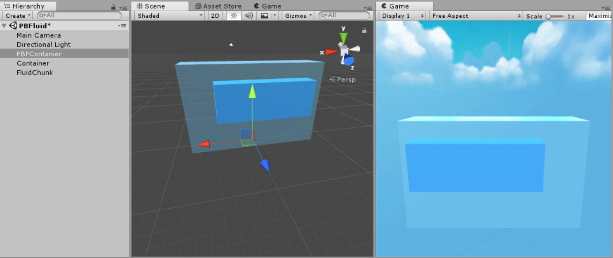

The above image shows an example scene of fluid simulation. Then you are ready to go.

#### Interactivity

Move and resize the fluid body chunk to create the fluid body and start simulation

Create blast in the fluid by click left button on mouse.
 - Raycasting is used to find the intersection point, then a blast is created.

Pause the simulation by pressing `Space`, then rescale the container by `J` `K` `L` `U` `I` `O`, press `B` to resume when you are ready.

 - A new hash grid and a new solver object is reconstructed when you resume the simulation.

## 5. More Possible Physical Object types
The project successfully demonstrated the flexibility of the GPU+PBD+Unity framework. Given this fact, more types of physical objects are achievable. For example, Rigid body can be easily simulated by a constraint that tries to maintain the body's original shape. 

For more options, check [The Position Based Dynamics library](https://github.com/InteractiveComputerGraphics/PositionBasedDynamics) on GitHub and the PBD paper for some inspirations.

## 6. Performance - The power of GPU

#### Performance on Cloth: Comparisons between CPU and GPU cloth

_Tested on: Windows 10, i7-6500U @ 2.50GHz 12GB RAM, GeForce 940M 8GB (Personal Laptop)_

The timestep of the simulation determines how many times the entire algorithm is run per frame. A lower timestep is generally required as the resolution of the cloth increases, though the cloth will appear very stiff when the timestep is too low. In the below graph, we can see that the GPU version of the algorithm handles a decreasing timestep a lot better than the CPU.

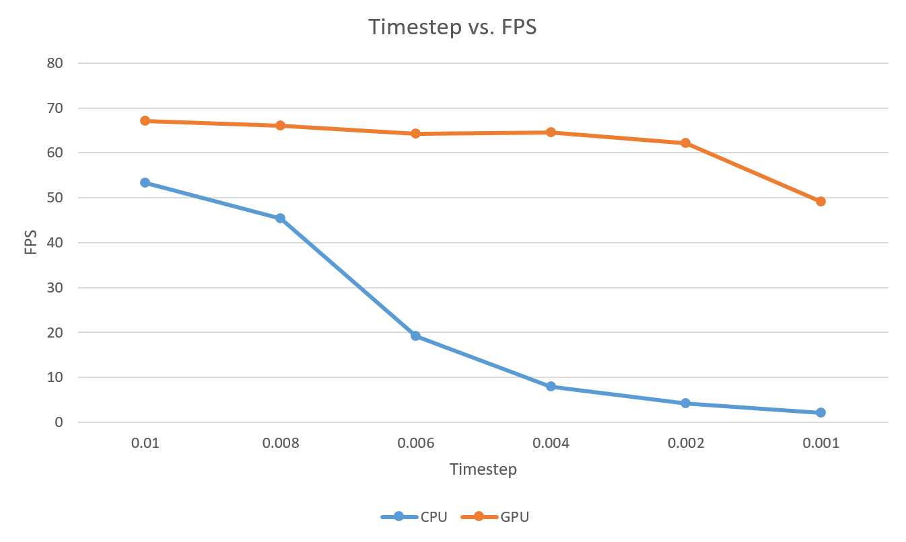

The iteration number controls the number of times the constraints are enforced. Similar to the timestep, a higher iteration number is usually required as the simulation gets more complex; an overly-high iteration number will also make the cloth seem stiff due to the over-enforcement of the constraints. The GPU version of the algorithm also does a much better job here than the CPU version. The framerate remained consistently over 60 and did not suffer any dips like it did with the timestep. This is probably because an decreased timestep increases the number of times the entire algorithm is run, while an increased iteration number only increases the number of times the constraint portion of the algorithm is run.

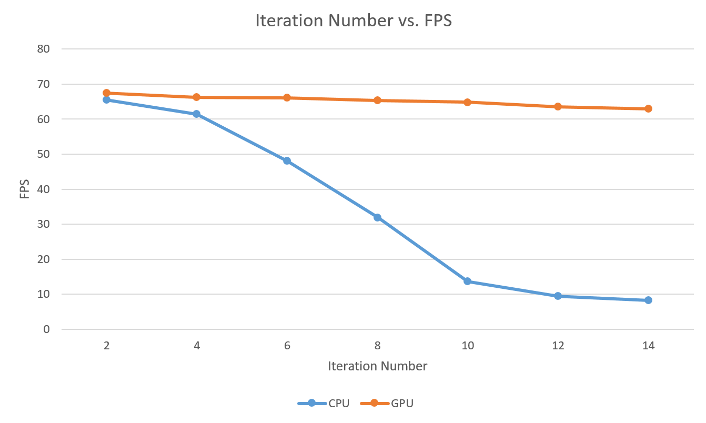

Finally, the GPU and CPU versions of the algorithm were tested on different resolutions of the cloth. The resolution of the cloth is essential to how real the cloth simulation looks, as a low resolution will make the cloth look blocky. The CPU version proved unable to handle anything more than 10x10, while the GPU version could handle 30x30 at a reasonable framerate. 

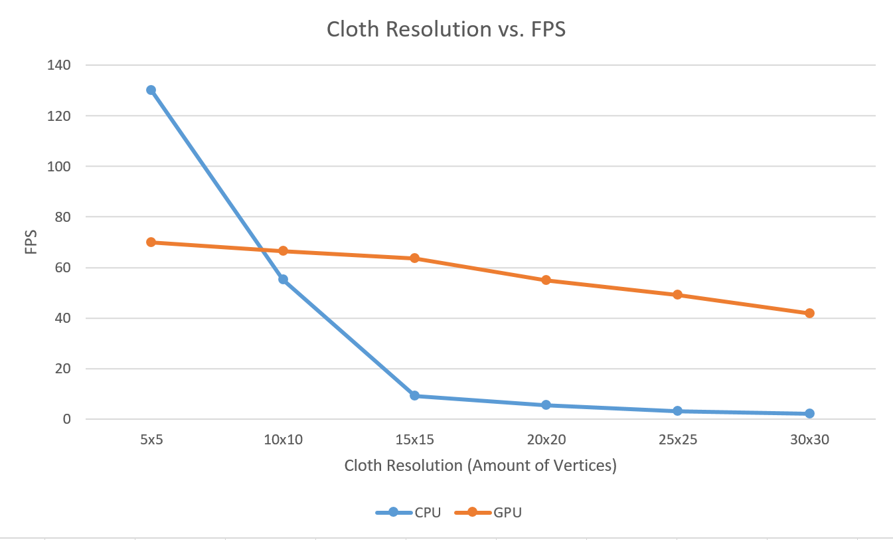

#### Performance on Fluid: the GPU power benchmark

_Tested on: Windows 10, i7-7700HQ @ 2.80GHz, 16GB, GTX 1050 4GB (Personal Laptop)_

_**We didn't implement the CPU version of PBF, so no comparison between CPU and GPU is provided**_

 * Time step vs. FPS

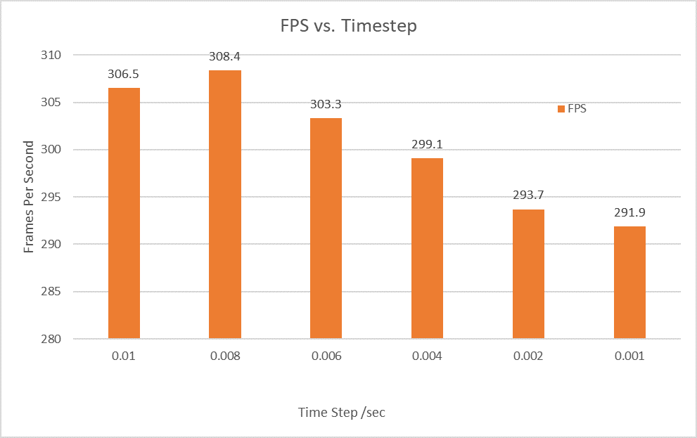

Similar to Cloth, the solver needs a smaller time step when particle amount goes high. Also, you can see more subtle details in the fluid simulation when time step goes down, which shows that timestep is crucial to physical simulations. But: PBD fluid are very stable even in high time steps like 0.01sec. And the FPS doesn't suffer a lot from the change of time step.

 * Iteration Number vs. FPS

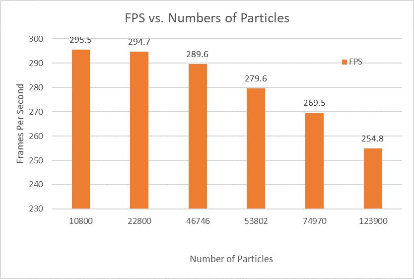

Theoretically, a larger number of iterations are required for more complex scene like more particles, but the whole simulation would get dramatically slowed down if you run the solver more times in a frame.

 * Number of Particles vs. FPS

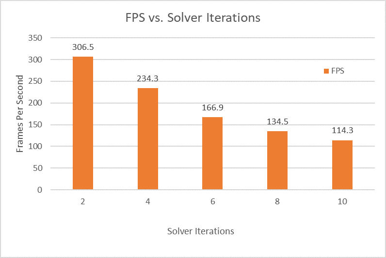

The number of particles to simulate is a critical factor to the FPS. As opposed to more advanced simulation techniques like Tall Cells, GPU version PBF could only decently handle ~100k particles(as of our Unity implementation). And as we have more and more particles in the scene, the simulation got farther and farther away from real-time. 

## 7. References
-	[Unite2016 Talk on GPU Accelerated Cloth Sim in Unity](https://www.youtube.com/watch?v=kCGHXlLR3l8)
-	[A Survey on Position Based Dynamics, 2017](https://www.animation.rwth-aachen.de/media/papers/2017-EG-CourseNotes.pdf)
-	[Unified Simulation of Rigid and Flexible Bodies using Position Based Dynamics](https://diglib.eg.org/handle/10.2312/vriphys20171083)
-	[The Position Based Dynamics library](https://github.com/InteractiveComputerGraphics/PositionBasedDynamics)
-	[Microsoft's Documentation on HLSL](https://docs.microsoft.com/en-us/windows/desktop/direct3dhlsl/dx-graphics-hlsl)
-   [XParticle - a simple example of unity compute shaders](https://github.com/antoinefournier/XParticle)
-   [Bitonic Sort](https://www.geeksforgeeks.org/bitonic-sort/)
-   [Bitonic Sort in compute shader](https://github.com/hjwdzh/Fluid3D)

## 8. Easter Eggs

